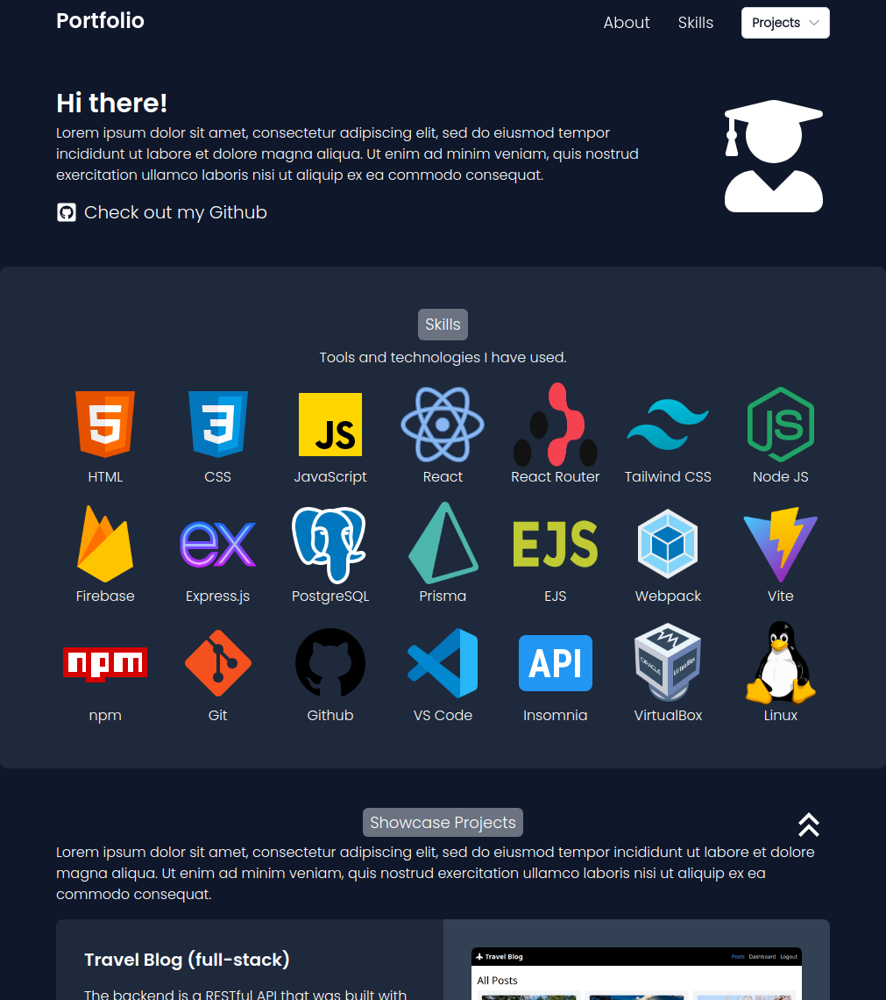
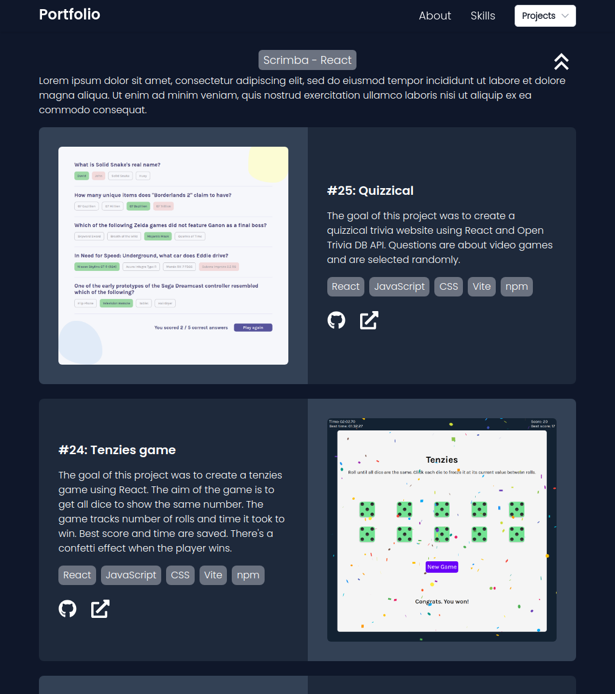
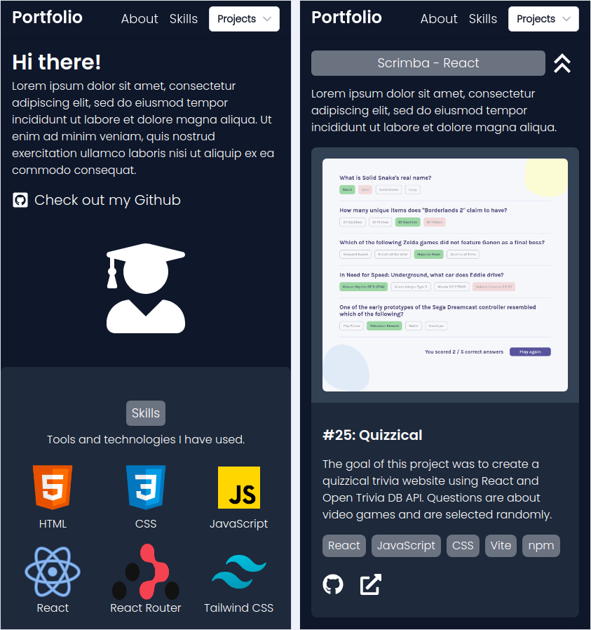

# Odin Project #21: Admin Dashboard

The goal of this Odin Project assignment was to create a responsive homepage, something one might find on a portfolio site of sorts. The purpose of this website is to showcase the projects I’ve built. To avoid repetition I created components for skills, project cards and project sections and the data comes from JavaScript objects stored in the data folder. 

The assignment wanted me to recreate a site using a provided design image in HTML and CSS but I decided to create my own design using Tailwind CSS and React.

I started and finished this project in September 2024.

## Assignment

[The Odin Project - Advanced HTML and CSS - #21 Library](https://www.theodinproject.com/lessons/node-path-advanced-html-and-css-homepage)

## Technology

- React
- JavaScript
- Tailwind CSS
- Vite

## Key Concepts

- Responsive design
- JSX
- Custom components
- Custom attributes (props)
- .map() function: converting data into an array of JSX components

## Screenshots

### Desktop





### Mobile



## Sources

- https://fonts.google.com/specimen/Poppins

## Deployment

```bash
# clone repo
git clone https://github.com/BrightNeon7631/odin-homepage.git

# install project dependencies
npm install

# run vite dev server
npm run dev

# create a production build
npm run build

# if you want to use this project you may need to edit the js objects in the data folder
```